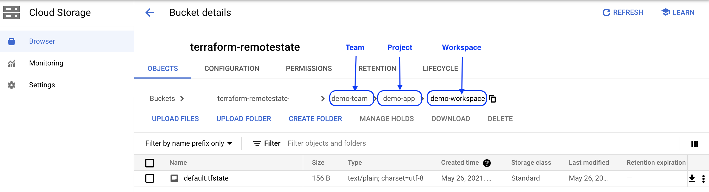

<p align="center">
    <a href="https://github.com/tomarv2/tfremote/actions/workflows/checks.yml" alt="Check">
        </a>
    <a href="https://www.apache.org/licenses/LICENSE-2.0" alt="GitHub tag">
        </a>
    <a href="https://github.com/tomarv2/tfremote/tags" alt="GitHub tag">
        </a>
    <a href="https://github.com/tomarv2/tfremote/pulse" alt="Activity">
        </a>
    <a href="https://stackoverflow.com/users/6679867/tomarv2" alt="Stack Exchange reputation">
        </a>
    <a href="https://discord.gg/XH975bzN" alt="chat on Discord">
        </a>
    <a href="https://twitter.com/intent/follow?screen_name=varuntomar2019" alt="follow on Twitter">
        </a>
</p>

# Terraform Remote State Manager([tfremote](https://pypi.org/project/tfremote/))

**tf** is a python package for managing terraform remote state for: Google(Gcloud), AWS, and Azure.
It sets a defined structure for all cloud providers by removing the overheard of configuring and managing the path in storage buckets.

It works with:

:point_right: Google Storage Bucket

:point_right: AWS S3

:point_right: Azure Storage

> ❗️ **Note** Best practice is to make sure buckets are versioned.

## Install package

```
pip install tfremote --upgrade
```

## Environment setup

- Install Python 3.8+

- Using virtualenv is strongly recommended:

```
python3 -m venv <venv name>
```

- Terraform 0.14.0 and above (download: https://www.terraform.io/downloads.html)

Default log level is `WARNING`, to change:

`export TF_LOG_LEVEL` to any of these: `'CRITICAL', 'ERROR', 'WARNING', 'INFO', 'DEBUG'`

> ❗️ **Important** - Two variables are required for using `tf` package to set path in remote storage:
>
> - teamid
> - prjid
>
> Required variables can be defined using:
>
> - As `inline variables` e.g.: `-var='teamid=demo-team' -var='prjid=demo-project'`
> - Inside `.tfvars` file e.g.: `-var-file=<tfvars file location> `
>
> Two optional variables:
>
> `workspace` and `state_key` can be defined using:
>
> - `-w=<workspace_name>`. If no workspace is provided `default` workspace is used.
>
> - `s=<state_key name>`. If no key is provided `terraform` is used.
>
> Path created in S3 backend: `/<teamid>/<prjid>/<workspace>/<state-key>`
>
> For more information refer to [Terraform documentation](https://www.terraform.io/docs/language/values/variables.html)

## Setup environment variables

### Workspace list file location `TF_WORKSPACE_FILE_LOCATION`

```
export TF_WORKSPACE_FILE_LOCATION=<workspace yml file location>
```

Reference file: [link](scripts/workspaces.yml)

### AWS

> ❗️ **Important** - s3 bucket for remote state should reside in `us-west-2`

Set below env variables:

```
export TF_AWS_BUCKET=<your_remote_state_bucket_name>
export TF_AWS_BUCKET_REGION=us-west-2
export TF_AWS_PROFILE=<aws profile to use>
```

```
export TF_AWS_BUCKET=<your_remote_state_bucket_name>
export TF_AWS_BUCKET_REGION=us-west-2
export AWS_ACCESS_KEY_ID=<aws access key>
export AWS_SECRET_ACCESS_KEY=<aws secret access key>
```

### Azure

To create storage for remote state there is handy script.

Run `scripts/remote_state.sh` (fill in the required information)

Set below env variables:

```
export TF_AZURE_STORAGE_ACCOUNT=<remote state storage account name>
export TF_AZURE_CONTAINER=<remote state container>
export ARM_ACCESS_KEY=<storage account access key>
```

### GCP(gcloud)

https://cloud.google.com/community/tutorials/managing-gcp-projects-with-terraform

Set below env variables:

```
export TF_GCLOUD_BUCKET=<remote state storage bucket name>
export TF_GCLOUD_CREDENTIALS=json credentials file path>
```

## Usage

### For GCP(gcloud):

```
tf plan -c=gcloud -var=teamid=demo-team -var=prjid=demo-app -w=demo-workspace
```

The structure in Google Storage Bucket:



### For AWS:

```
tf plan -c=aws -var=teamid=demo-team -var=prjid=demo-app -w=demo-workspace
```

The structure in AWS S3:


If you need to specify `state_key` in S3, specify `-s=tryme-key`

### For Azure:

```
tf plan -c=azure -var=teamid=demo-team -var=prjid=demo-app -w=demo-workspace
```

The structure in Azure Storage:


### For more available options:

```
tf -h
usage: tf [-h] [-var] [-var-file] [-c] [-w] [-s] [-f] [-nf] [-v]

Terraform remote state wrapper package
--------------------------------------
Usage: Set below env variables to begin (more information: https://github.com/tomarv2/tfremote):
TF_WORKSPACE_FILE_LOCATION
aws: TF_AWS_BUCKET, TF_AWS_PROFILE, TF_AWS_BUCKET_REGION=us-west-2
azure: TF_AZURE_STORAGE_ACCOUNT, TF_AZURE_CONTAINER, ARM_ACCESS_KEY
gcloud: TF_GCLOUD_BUCKET, TF_GCLOUD_CREDENTIALS

optional arguments:
  -h, --help  show this help message and exit
  -var        set Terraform configuration variable. This flag can be set multiple times
  -var-file   set Terraform configuration variables from a file. This flag can be set multiple times
  -c          specify cloud provider (default: 'aws'). Supported values: gcloud, aws, or azure)
  -w          specify existing workspace name(default: 'default')
  -s          file name in remote state (default: 'terraform.tfstate')
  -f          enable FIPS endpoints (default: True)
  -nf         disable FIPS endpoints
  -v          show program's version number and exit
```
